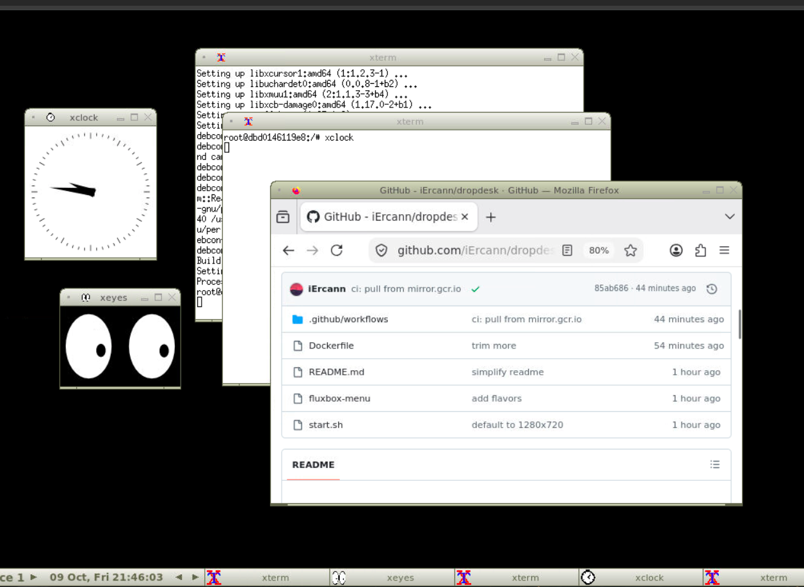
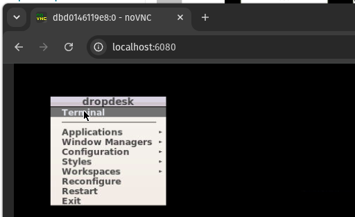

# dropdesk

Drop a Linux desktop anywhere Docker runs.



## Docker

```sh
docker run -d --name dropdesk -p 127.0.0.1:6080:6080 ghcr.io/iercann/dropdesk
```

Open <http://localhost:6080>. Right-click the desktop for the menu.



Only your machine can reach it. To open it to your LAN, use `-p 6080:6080` (see [Security](#security)).

## Images

| Image | What's in it |
|---|---|
| `ghcr.io/iercann/dropdesk:latest` | desktop + terminal |
| `ghcr.io/iercann/dropdesk:firefox` | + Firefox |
| `ghcr.io/iercann/dropdesk:chromium` | + Chromium |

For amd64 and arm64.

## Proxmox (9.1+)

1. Your storage (e.g. `local`) -> CT Templates -> Pull from OCI Registry
2. Reference `ghcr.io/iercann/dropdesk`, tag `latest` (or `firefox` / `chromium`)
3. Create CT, pick the image as template, network on DHCP
4. Start it and open `http://<container-ip>:6080`

Anyone on your LAN can open it (it gets its own IP). See [Security](#security).

## Settings

| Env | Default | |
|---|---|---|
| `RESOLUTION` | `1280x720` | screen size |

Docker: `-e RESOLUTION=1920x1080`. Proxmox: in the container's environment variables.

## Security

There's no password. Whoever can reach port 6080 gets the desktop (as root).
Fine on your machine or LAN, but don't put it on a VPS with `-p 6080:6080` ([ufw won't block it](https://docs.docker.com/engine/network/packet-filtering-firewalls/#docker-and-ufw)).

## FAQ

**Where are my files?**
Docker: gone when you remove the container, keep them with `-v dropdesk-home:/root`.
Proxmox: the container disk keeps them.

**How do I add apps?**
`apt update && apt install <app>` in the terminal, or build your own image:

```sh
docker build -t my-desk --build-arg EXTRA_PACKAGES="gimp vlc" .
```

**Browser tabs crash in Docker?**
Docker's `/dev/shm` is only 64MB. Add `--shm-size=1g`.

## How it works

```
Xvfb  ->  fluxbox  ->  x11vnc  ->  websockify + noVNC  ->  your browser
(screen)  (windows)    (stream it)  (make it web-friendly)
```

[Xvfb](https://linux.die.net/man/1/xvfb) is a fake screen in memory, fluxbox manages the windows,
x11vnc streams the screen over VNC, websockify + noVNC make it work in a browser.
